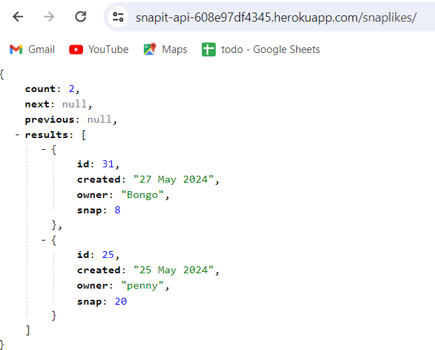
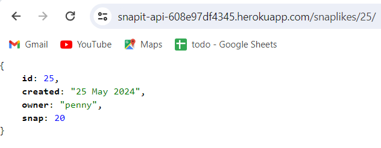
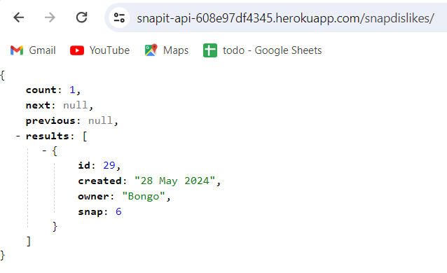
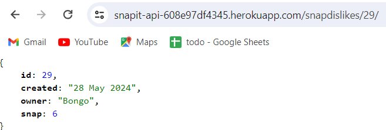
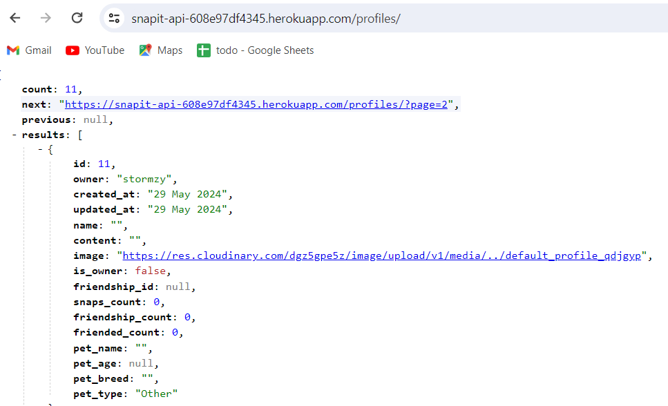
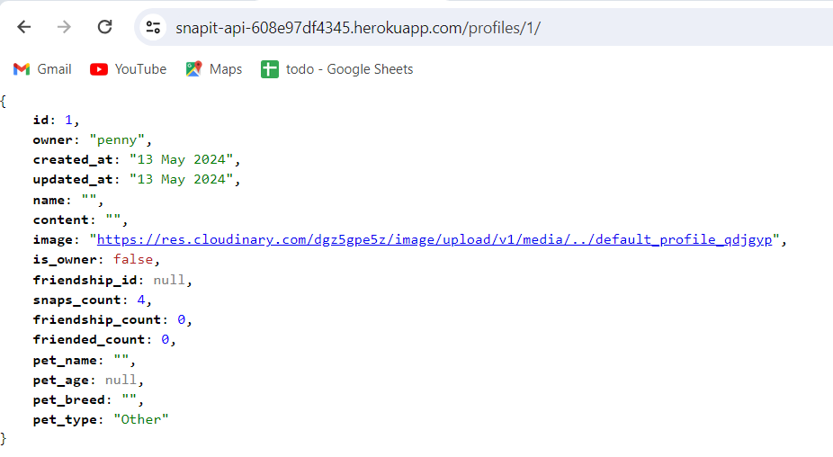
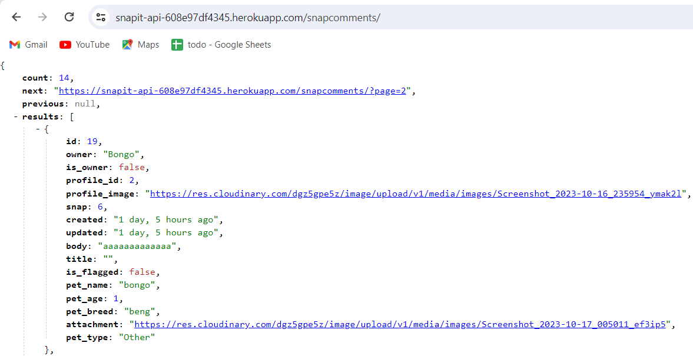
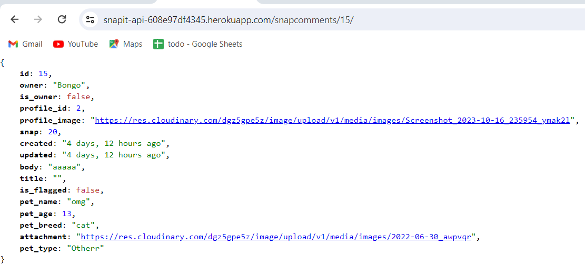
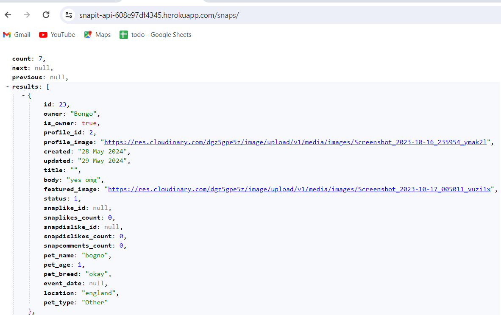
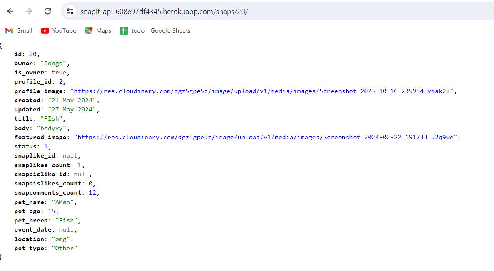

# Snap It API!

### Data Models

#### Friendships
* SnapFriendship, represents a friendship relationship between
two users. It has foreign key references to the User model for both the owner and the friended user,
ensuring that each friendship is unique through the
unique_together constraint on these fields. The model
also includes a timestamp for when the friendship was
created and a string representation method that returns
the usernames of the owner and friended users.

#### Profiles
* Profile model
associated with the Django User model
via a one-to-one relationship,
containing fields such as name, content,
image, and pet-related information.
The model automatically records timestamps
for creation and updates, and orders profiles
by the creation date in descending order. A
friendship_count property is defined to count the
number of friendships for the profile's owner. Additionally,
a signal handler create_profile ensures a profile is created for
each new user, connecting to the post_save signal of the User model.

#### SnapComments
* SnapComment, represents comments on snaps made by users.
Each SnapComment is linked to a user (owner) and a snap,
and includes fields such as title, body, pet details,
attachment, and timestamps for creation and update.
The model also includes metadata to order comments by creation
date in descending order and a __str__ method to return a string
representation of the comment using its ID and title.

#### SnapDislikes
* SnapDislike, where a user dislikes a snap.
Each SnapDislike instance is associated with a user
(owner) and a snap. The model includes a timestamp for
when the dislike was created and ensures that each
combination of user and snap is unique, ordering them
by creation date in descending order.

#### SnapLikes
* SnapLike,
which represents a like given by a user to a snap.
Each SnapLike is linked to a user (owner) and a snap,
with a timestamp for when the like was created. The
model ensures uniqueness for each combination of user
and snap, orders the likes by creation date in descending
order, and provides a string representation combining
the owner's username and the snap.

#### Snaps
*     The Snap model contains fields such as owner, created,
    updated, title, body, featured_image, and status,
    with appropriate data types and constraints. The Meta
    inner class specifies the default ordering of instances
    based on the date they were made.

    ## Frameworks, libraries and dependencies

The following additional utilities, apps and modules were used.

### django-cloudinary-storage
https://pypi.org/project/django-cloudinary-storage/

Enables cloudinary integration for storing user profile images in cloudinary.

### dj-allauth
https://django-allauth.readthedocs.io/en/latest/

Used for user authentication. This package enables registration and authentication using a range of social media accounts. 

### dj-rest-auth
https://dj-rest-auth.readthedocs.io/en/latest/introduction.html

Provides REST API endpoints for login and logout. The user registration endpoints provided by dj-rest-auth 

### djangorestframework-simplejwt
https://django-rest-framework-simplejwt.readthedocs.io/en/latest/

Provides JSON web token authentication.

### dj-database-url
https://pypi.org/project/dj-database-url/

Creates an environment variable to configure the connection to the database.

### psychopg2
https://pypi.org/project/psycopg2/

Database adapater to enable interaction between Python and the PostgreSQL database.

### python-dateutil
https://pypi.org/project/python-dateutil/

This module provides extensions to the standard Python datetime module. It is a pre-requisite for django-recurrence library.

### django-filter
https://django-filter.readthedocs.io/en/stable/

Django Filter is utilized in the SnapList view to enable dynamic filtering, searching, and ordering of Snap instances based on specified fields such as the owner's profile, snap attributes, and related model counts. The filter_backends, filterset_fields, search_fields, and ordering_fields attributes define the filtering mechanisms, allowing for a highly flexible and user-friendly querying experience.

### django-cors-headers
https://pypi.org/project/django-cors-headers/

This Django app adds Cross-Origin-Resource Sharing (CORS) headers to responses, to enable the API to respond to requests from origins other than its own host.

#### Technologies used

* asgiref==3.7.2
* autopep8==2.0.4
* bleach==6.1.0
* blinker==1.7.0
* certifi==2023.11.17
* cffi==1.16.0
* charset-normalizer==3.3.2
* click==8.1.7
* cloudinary==1.36.0
* colorama==0.4.6
* crispy-bootstrap5==0.7
* cryptography==41.0.7
* defusedxml==0.7.1
* distlib==0.3.8
* dj-database-url==0.5.0
* dj-rest-auth==2.1.9
* dj3-cloudinary-storage==0.0.6
* Django==3.2.25
* django-allauth==0.44.0
* django-cloudinary-storage==0.3.0
* django-cors-headers==4.3.1
* django-environ==0.11.2
* django-filter==2.4.0
* django-summernote==0.8.20.0
* djangorestframework==3.15.1
* djangorestframework-simplejwt==5.3.1
* filelock==3.13.1
* Flask==3.0.0
* gunicorn==20.1.0
* idna==3.6
* itsdangerous==2.1.2
* Jinja2==3.1.2
* MarkupSafe==2.1.3
* oauthlib==3.2.2
* Pillow==10.1.0
* platformdirs==4.2.0
* psycopg2==2.9.9
* pycodestyle==2.11.1
* pycparser==2.21
* PyJWT==2.8.0
* python3-openid==3.2.0
* pytz==2024.1
* requests==2.31.0
* requests-oauthlib==1.3.1
* setuptools==69.0.3
* six==1.16.0
* sqlparse==0.4.4
* tzdata==2023.4
* urllib3==1.26.18
* virtualenv==20.25.0
* webencodings==0.5.1
* Werkzeug==3.0.1
* whitenoise==5.3.0

### Testing

Throughout the build of the Snap It API project, rigorous testing was implemented to ensuring functionality and seamless integration between the new front-end React application and the deployed heroku live link version. Initially, unit tests were created for the Django backend to validate individual endpoints and data processing functions. As development progressed, integration tests were employed to verify the communication between the React app and the Django API, ensuring data fetched and submitted through API requests matched the expected outcomes. End-to-end testing was also conducted, simulating user interactions from the React interface to the backend, to validate the overall user experience and flow. This comprehensive testing strategy, encompassing unit, integration, and end-to-end tests, facilitated early detection and resolution of bugs, ensuring a smooth and reliable release.

1. Test Listing All Snap Likes
- Test: List all snap likes.
- Outcome: All snap likes are listed.
---

---
2. Test Getting individual SnapLike
- Test: Get Snap Like by ID
- Outcome: Snap Like is got by ID
---

---
3. Test Listing All Snap Dislikes
- Test: List all snap dislikes.
- Outcome: All snap dislikes are listed.
---

---
4. Test Getting individual Snap Dislike
- Test: Get Snap Dislike by ID
- Outcome: Snap Dislike is got by ID
---

---
5. Test Listing All Profiles
- Test: List all Profiles.
- Outcome: All profiles are listed.
---

---
6. Test Getting individual Profile
- Test: Get Profile by ID
- Outcome: Profile is got by ID
---

---
7. Test Listing All Comments
- Test: List all Comments.
- Outcome: All Comments are listed.
---

---
8. Test Getting individual Comments
- Test: Get Comments by ID
- Outcome: Comment is got by ID
---

---
9. Test Listing All Snaps
- Test: List all Snaps
- Outcome: All Snaps are listed.
---

---
10. Test Getting individual Snap
- Test: Get Snap by ID
- Outcome: Snap is got by ID
---

---

### Python Validation
1. Friendships
- models.py
- no errors
- serializers.py
- no errors
- urls.py
- no errors
- views.py
- no errors
2. Profiles
- models.py
- no errors
- serializers.py
- no errors
- urls.py
- no errors
- views.py
- no errors
3. snap_comments
- models.py
- no errors
- serializers.py
- no errors
- urls.py
- no errors
- views.py
- no errors
4. snap_dislikes
- models.py
- no errors
- serializers.py
- no errors
- urls.py
- no errors
- views.py
- no errors
5. snaplikes
- models.py
- no errors
- serializers.py
- no errors
- urls.py
- no errors
- views.py
- no errors
6. snaps
- models.py
- no errors
- serializers.py
- no errors
- urls.py
- no errors
- views.py
- no errors

### Unresolved bugs
* Ideally the front end site would have an aspect where you can friend and unfriend other users, the model is still in the backend and some of the code still in the front end as I ran into a bug I could not seem to figure out... When clicking on the front end friend button it threw out a 500 internal server error, however I have no idea why, I tried to reach out to tutor support but as I use vscode it took a while for everything to become accessible in gitpod due to configvars, cors allowed origins, ect... I wondered whether it was a PUT request instead of a POST request but that did not work... 
* The profile picture does not seem to be rendering... however I know cloudinary is working as I can update the profile picture and snaps. However I know the url works, as when put directly into the browser there is no issue.

### API endpoints

| **URL** | **Notes** | **HTTP Method** | **CRUD operation** | **View type** | **POST/PUT data format** |
|---|---|---:|---|---:|---|
| **Profile endpoints** |  |  |  |  |  |
| /profiles/ | List all profiles. | GET | Read | List | N/A |
| /profiles/ | Create a new profile. | POST | Create | List | {  "owner": int,  "name": "string",  "content": "string",  "image": "file",  "pet_name": "string",  "pet_age": int,  "pet_breed": "string",  "pet_type": "string" } |
| /profiles/id | Retrieve a specific profile by ID. | GET | Read | Detail | N/A |
| /profiles/id | Update an existing profile by ID. | PUT | Update | Detail | {  "name": "string",  "content": "string",  "image": "file",  "pet_name": "string",  "pet_age": int,  "pet_breed": "string",  "pet_type": "string" } |
| /profiles/id | Delete a specific profile by ID. | DELETE | Delete | Detail | N/A |
| **Snap endpoints** |  |  |  |  |  |
| /snaps/ | List all snaps. | GET | Read | List | N/A |
| /snaps/ | Create a new snap. | POST | Create | List | {  "owner": int,  "title": "string",  "body": "string",  "featured_image": "file",  "status": int,  "pet_name": "string",  "pet_age": int,  "pet_breed": "string",  "event_date": "datetime",  "location": "string",  "pet_type": "string" } |
| /snaps/id | Retrieve a specific snap by ID. | GET | Read | Detail | N/A |
| /snaps/id | Update an existing snap by ID. | PUT | Update | Detail | {  "title": "string",  "body": "string",  "featured_image": "file",  "status": int,  "pet_name": "string",  "pet_age": int,  "pet_breed": "string",  "event_date": "datetime",  "location": "string",  "pet_type": "string" } |
| /snaps/id | Delete a specific snap by ID. | DELETE | Delete | Detail | N/A |
| **Snap Comment endpoints** |  |  |  |  |  |
| /snapcomments/ | List all snap comments. | GET | Read | List | N/A |
| /snapcomments/ | Create a new snap comment. | POST | Create | List | {  "owner": int,  "snap": int,  "title": "string",  "body": "string",  "is_flagged": bool,  "pet_name": "string",  "pet_age": int,  "pet_breed": "string",  "pet_type": "string",  "attachment": "file" } |
| /snapcomments/id | Retrieve a specific snap comment by ID. | GET | Read | Detail | N/A |
| /snapcomments/id | Update an existing snap comment by ID. | PUT | Update | Detail | {  "title": "string",  "body": "string",  "is_flagged": bool,  "pet_name": "string",  "pet_age": int,  "pet_breed": "string",  "pet_type": "string",  "attachment": "file" } |
| /snapcomments/id | Delete a specific snap comment by ID. | DELETE | Delete | Detail | N/A |
| **Snap Like endpoints** |  |  |  |  |  |
| /snaplikes/ | List all snap likes. | GET | Read | List | N/A |
| /snaplikes/ | Create a new snap like. | POST | Create | List | {  "owner": int,  "snap": int } |
| /snaplikes/id | Retrieve a specific snap like by ID. | GET | Read | Detail | N/A |
| /snaplikes/id | Delete a specific snap like by ID. | DELETE | Delete | Detail | N/A |
| **Snap Dislike endpoints** |  |  |  |  |  |
| /snapdislikes/ | List all snap dislikes. | GET | Read | List | N/A |
| /snapdislikes/ | Create a new snap dislike. | POST | Create | List | {  "owner": int,  "snap": int } |
| /snapdislikes/id | Retrieve a specific snap dislike by ID. | GET | Read | Detail | N/A |
| /snapdislikes/id | Delete a specific snap dislike by ID. | DELETE | Delete | Detail | N/A |

### Project Deployment

The site was deployed via Heroku, and the live link can be found here - [
To deploy the project through Heroku I followed these steps:
* Sign up / Log in to [Heroku](https://www.heroku.com/)
* From the main Heroku Dashboard page select 'New' and then 'Create New App'
* Give the project a name - I entered The-Pantry and select a suitable region, then select create app. The name for the app must be unique.
* This will create the app within Heroku and bring you to the deploy tab. From the submenu at the top, navigate to the resources tab.
* Add the database to the app, in the add-ons section search for 'Heroku Postgres', select the package that appears and add 'Heroku Postgres' as the database
* Navigate to the setting tab, within the config vars section copy the DATABASE_URL to the clipboard for use in the Django configuration.
* Within the django app repository create a new file called env.py - within this file import the os library and set the environment variable for the DATABASE_URL pasting in the address copied from Heroku. The line should appear as os.environ["DATABASE_URL"]= "Paste the link in here"
* Add a secret key to the app using os.environ["SECRET_KEY"] = "your secret key goes here"
* Add the secret key just created to the Heroku Config Vars as SECRET_KEY for the KEY value and the secret key value you created as the VALUE
* In the settings.py file within the django app, `import Path from pathlib, import os and import dj_database_url`
* insert the line `if os.path.isfile("env.py"): import env`
* remove the insecure secret key that django has in the settings file by default and replace it with `SECRET_KEY = os.environ.get('SECRET_KEY')`
* replace the databases section with `DATABASES = { 'default': dj_database_url.parse(os.environ.get("DATABASE_URL"))}` ensure the correct indentation for python is used.
* In the terminal migrate the models over to the new database connection
* Navigate in a browser to cloudinary, log in, or create an account and log in. 
* From the dashboard - copy the CLOUDINARY_URL to the clipboard
* in the env.py file created earlier - add os.environ["CLOUDINARY_URL"] = "paste in the Url copied to the clipboard here"
* In Heroku, add the CLOUDINARY_URL and value copied to the clipboard to the config vars
* Also add the KEY - DISABLE_COLLECTSTATIC with the Value - 1 to the config vars
* this key value pair must be removed prior to final deployment
* Add the cloudinary libraries to the list of installed apps, the order they are inserted is important, `cloudinary_storage` goes above `django.contrib.staticfiles` and `cloudinary` goes below it.
* in the Settings.py file - add the STATIC files settings - the url, storage path, directory path, root path, media url and default file storage path.
* Link the file to the templates directory in Heroku `TEMPLATES_DIR = os.path.join(BASE_DIR, 'templates')`
* Change the templates directory to TEMPLATES_DIR - 'DIRS': [TEMPLATES_DIR]
* Add Heroku to the ALLOWED_HOSTS list the format will be the app name given in Heroku when creating the app followed by .herokuapp.com
* In your code editor, create three new top level folders, media, static, templates
* Create a new file on the top level directory - Procfile
* Within the Procfile add the code - web: guincorn PROJECT_NAME.wsgi
* In the terminal, add the changed files, commit and push to GitHub
* In Heroku, navigate to the deployment tab and deploy the branch manually - watch the build logs for any errors.
* Heroku will now build the app for you. Once it has completed the build process you will see a 'Your App Was Successfully Deployed' message and a link to the app to visit the live site.

#### Create a clone of this repository
Creating a clone enables you to make a copy of the repository at that point in time - this lets you run a copy of the project locally:
This can be done by:
* Navigate to https://github.com/PennyTrain/Aquarium/
* click on the arrow on the green code button at the top of the list of files
* select the clone by https option and copy the URL it provides to the clipboard
* Navigate to your code editor of choice and within the terminal change the directory to the location you want to clone the repository to.
* type 'git clone' and paste the https link you copied from github
* press enter and git will clone the repository to your local machine

#### Installing requirements.txt
Due to certian packages being required the system nneds to know which ones in order to runt his project as successfully as possible.
* Everytime I installed a new package to use on the development I ran the command `pip freeze --local > requirements.txt`
* This saves the current packages that are required to the requirements.txt file itself. 

* However when Cloning or starting in a new workspaces the content(packages) within the requirements.txt will need to be installed this is done by the following command `pip install -r requirements.txt`

#### Packages Used

* VS Code was used to develop the site
* Git was utilized for version control and transferring files between the code editor and the repository
* GitHub was utilized for storing the files for this project

## Credits
--- 
### Content
---
* The text for all pages was created by myself.
* Icons used for the various links on the site were taken from [Font Awesome](https://fontawesome.com/)
* The reference material on HTML and CSS provided by [w3schools.com](https://www.w3schools.com/)

### Media
---
* The css reset was provided by [css reset](http://meyerweb.com/eric/tools/css/reset/)
* The Favicon, links and meta code were generated by [Realfavicongenerator.net](https://realfavicongenerator.net).

### Resources Used

* The Django documentation was used extensively during development of this project
* The Cloudinary documentation was used extensively during development to setup the configuration between django and the cloudinary apis
* The Code Institute reference material was used as a general reference for things that I had previously done during the course.
* W3 Schools was used as a reference point for HTML, CSS and Python.

### Acknowledgements

* I'd like to thank the following:
- Matt Bodden, for the significant ideas for my project - your guidance truly made a difference!
- Oliver Train, for all his help regarding his patience and pointing me in the right direction.
- Jubril, for all his help during this project as my mentor.
